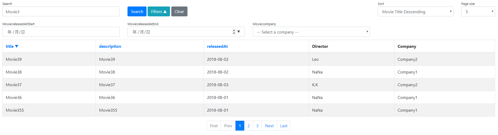

NadiaPaginatorBundle
====================

NadiaPaginatorBundle can help you build pagination UI quickly. You can design your filter and search UI with Symfony Form component, and easily validate input parameters with Form.



## Installation

Install with composer , run:

```sh
composer require nadialabs/paginator-bundle
```

## Register Bundle to AppKernel

```php
// app/AppKernel.php
public function registerBundles()
{
    return array(
        // ...
        new Nadia\Bundle\PaginatorBundle\NadiaPaginatorBundle(),
        // ...
    );
}
```

## Bundle Configuration

```yaml
nadia_paginator:
    default_options:
        input_key_class: Nadia\Bundle\PaginatorBundle\Input\InputKeys
        default_page_size: 10
        default_page_range: 8
        session_enabled: false
        default_translation_domain: null
    templates:
        pages: '@NadiaPaginator/templates/bootstrap4/pages.html.twig'
        searches: '@NadiaPaginator/templates/bootstrap4/searches.html.twig'
        filters: '@NadiaPaginator/templates/bootstrap4/filters.html.twig'
        sorts: '@NadiaPaginator/templates/bootstrap4/sorts.html.twig'
        sort_link: '@NadiaPaginator/templates/bootstrap4/sort_link.html.twig'
        page_sizes: '@NadiaPaginator/templates/bootstrap4/page_sizes.html.twig'
```

- default_options
    - input_key_class: The class that define the http request parameter keys.
    - default_page_size: Default page size
    - default_page_range: Default page range (control page link amounts)
    - session_enabled: Enable session support, store input data in session.
                       You can use a clean URL without query string when enabled it.
                       Otherwise the filter, search, sort, page size, and page parameters will be part of URL query string, or transfer by POST request body.
    - default_translation_domain: Default [`translation-domain`](https://symfony.com/doc/3.4/reference/forms/types/form.html#translation-domain) value for each Form.
- templates
    - pages: Template for rendering pages
    - searches: Template for rendering searches block
    - filters: Template for rendering filters block
    - sorts: Template for rendering sort selection block
    - sort_link: Template for rendering sort link
    - page_sizes: Template for rendering page size selection block

## Create PaginatorType class

Define a Paginator configuration.

Example class: [`AppBundle\Paginator\Movies\PaginatorType`](Resources/examples/AppBundle/Paginator/Movies/PaginatorType.php)

You can implement these methods to define a PaginatorType class:

#### `buildSearch`

Use [`SearchBuilder`](Configuration/SearchBuilder.php) to setup search form elements with Symfony FormType styles.

#### `buildFilter`

Use [`FilterBuilder`](Configuration/FilterBuilder.php) to setup filter form elements with Symfony FormType styles.

#### `buildSort`

Use [`SortBuilder`](Configuration/SortBuilder.php) to setup sorting methods.

#### `buildPageSize`

Use [`PageSizeBuilder`](Configuration/PageSizeBuilder.php) to setup page size list.

#### `getFormOptions`

Setup the paginator form options, return an array contain form options.

#### `configureOptions`

Setup the paginator options, you can define custom options to injecting extra data into PaginatorType. PaginatorType will use this options in these methods: `buildSearch` `buildFilter` `buildSort` `buildPageSize` `getFormOptions`.

### Create SearchQueryCompiler class

Define a QueryCompiler to build custom search criteria.

Example class for Doctrine QueryBuilder: [`AppBundle\Paginator\Movies\FilterQueryCompiler`](Resources/examples/AppBundle/Paginator/Movies/SearchQueryCompiler.php)

### Create FilterQueryCompiler class

Define a QueryCompiler to build custom filter criteria.

Example class for Doctrine QueryBuilder: [`AppBundle\Paginator\Movies\FilterQueryCompiler`](Resources/examples/AppBundle/Paginator/Movies/FilterQueryCompiler.php)


## Create Pagination instance with PaginatorType

Example controller: [`MovieController`](Resources/examples/AppBundle/Controller/MovieController.php)  
Example entities: [`Movie`](Resources/examples/AppBundle/Entity/Movie.php), [`People`](Resources/examples/AppBundle/Entity/People.php)

To get a Pagination instance, the process as below:

1. Use [`PaginatorTypeContainer`](DependencyInjection/Container/PaginatorTypeContainer.php) to generate a PaginatorType instance.
2. Use [`PaginatorFactory`](Factory/PaginatorFactory.php) to generate a Paginator instance with a PaginatorType instance.
3. Create a query instance (in this example is a Doctrine ORM QueryBuilder instance)
4. Do paginate with Paginator, and get a Pagination instance
5. Render a view with Pagination instance

```php
// Example controller action

$options = [
    'movieCompanies' => [
        'Warner Bros.',
        'Sony Pictures',
        'Walt Disney',
        'Universal Pictures',
        '20th Century Fox',
        'Paramount Pictures',
        'Lionsgate Films',
        'The Weinstein Company',
        'DreamWorks Pictures',
    ],
];
$paginator = $this->get('nadia_paginator.paginator_factory')->create(PaginatorType::class, $options);

$qb = $this->getDoctrine()->getRepository(Movie::class)
    ->createQueryBuilder('movie')
    ->select(['movie', 'director'])
    ->leftJoin('movie.director', 'director')
;
/** @var Movie[]|Collection|Pagination $pagination */
$pagination = $paginator->paginate($qb);
```


## Rendering HTML with Twig

You can easily render a list page with this template [`@NadiaPaginator/templates/bootstrap4/pagination.html.twig`](Resources/views/templates/bootstrap4/pagination.html.twig)  
Use twig [`embed`](https://twig.symfony.com/doc/2.x/tags/embed.html) tag to overwrite `tableContent` block and put your table contents in `tableContent` block.

Example twig file: [`index.html.twig`](Resources/examples/AppBundle/Resources/views/Movie/index.html.twig)

```php
// Render view
$this->render('@App/Movie/index.html.twig', ['pagination' => $pagination]);
```
```twig
{# Example view file #}



<div class="container-fluid">
    {{ block('pagination') }}
</div>


    <table class="table table-bordered table-striped">
        <thead>
        <tr>
            <th>
                {{ nadia_paginator_sort_link(pagination, 'title', 'movie.title', 'ASC') }}
            </th>
            <th>
                {{ nadia_paginator_sort_link(pagination, 'description', 'movie.description', 'ASC') }}
            </th>
            <th>
                {{ nadia_paginator_sort_link(pagination, 'releasedAt', 'movie.releasedAt', 'DESC') }}
            </th>
            <th>Director</th>
            <th>Company</th>
        </tr>
        </thead>
        <tbody>
        
            <tr>
                <td>{{ movie.title }}</td>
                <td>{{ movie.description }}</td>
                <td>{{ movie.releasedAt|date('Y-m-d') }}</td>
                <td>{{ movie.director.name }}</td>
                <td>{{ movie.company }}</td>
            </tr>
        
        </tbody>
    </table>


```

### Rendering searches block in Twig

Use `nadia_paginator_searches` method to render search block in Twig template.

```twig
{{ nadia_paginator_searches(pagination, {attributes: {class: 'col-md-6 col-xl-4 search'}}) }}
```

### Rendering filters block in Twig

Use `nadia_paginator_filters` method to render filter block in Twig template.

```twig
{{ nadia_paginator_filters(pagination, {attributes: {class: 'col-md-4 col-xl-3 mb-1 filter'}}) }}
```

### Rendering sorts block in Twig

Use `nadia_paginator_sorts` method to render sorting block in Twig template.

```twig
{{ nadia_paginator_sorts(pagination) }}
```

### Rendering page sizes block in Twig

Use `nadia_paginator_page_sizes` method to render page sizes block in Twig template.

```twig
{{ nadia_paginator_page_sizes(pagination) }}
```

### Rendering sort link in Twig

```twig
{{ nadia_paginator_sort_link(pagination, 'title', 'movie.title', 'ASC') }}
```
